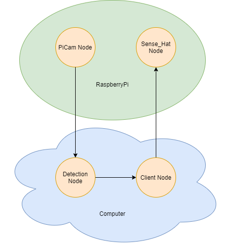

# Duckie Detection ROS and RR Trials
Simplified version for duckie detection of https://github.com/duckietown/duckietown-objdet/tree/master/ros-objdet/src/tf_object_detection

# Prerequisites:
* TensorFlow 1.9
* Ubuntu 18.04
* ROS Melodic
* RobotRaconteur python2
* python2

# Info:
## Raspberry Pi:
* username: `pi`
* hostname: `raspberrypi`
* password: `rpi1234`

# Setup
## Ubuntu Melodic On computer
It's up to you to use virtual machine or native Ubuntu. 

Instructions for Ubuntu on VM: https://www.toptechskills.com/linux-tutorials-courses/how-to-install-ubuntu-1804-bionic-virtualbox/
Instructions for native Ubuntu: https://ubuntu.com/tutorials/install-ubuntu-desktop#1-overview

After installation is done, the next step is to install packages listed in Prerequisites section. 
```
$ sudo apt-get update
$ pip install --upgrade pip
$ pip install opencv-python
$ pip install tensorflow==1.9`
```

To install ROS and RR, follow the instruction on the official website:
* ROS: http://wiki.ros.org/melodic/Installation/Ubuntu
* RR: https://github.com/robotraconteur/robotraconteur/wiki/Download

Finally, clone this repository under your root directory:
```
$ cd ~
$ git clone --recurse  https://github.com/hehonglu123/pihat_trials.git
```
## Raspberry Pi
### Hardware
Put the Picam cable throught the Sense Hat, and plug it in the RaspberryPi camera port. Then simply stack the sense hat on top of RaspberryPi, and clip the camera mount on the hat.

### Software
We provide a ready to run Raspberry Pi OS (32-bit) on drive: https://drive.google.com/file/d/1ZJ7RVAJXfff_L90s0reFc6EkSi-Cm709/view?usp=sharing. Download it, and make sure the SD card is at least 16GB. 
To burn the card, try [balenaetcher](https://www.balena.io/etcher/). It may take a while to do so (~10 min)

After it's finished, connect HDMI cable, mouse and keyboard to the RaspberryPi, and then power it up with 2.5A microUSB. It should boot up in one minute, and then connect to your local WiFi by clicking the network icon on the top right. Once you are connected, open up the browser to make sure you are connected. Then open up a new terminal, type in `$ hostname -I` to get your IP address, take a note here as it may be needed later. 

All packages needed are already installed in the image, so just clone this repository under your root directory:
```
$ cd ~
$ git clone --recurse https://github.com/hehonglu123/pihat_trials.git
```

To try out the connection between RaspberryPi and computer, try ping your RaspberryPi on computer first:
```
ping raspberrypi
```
or
```
ping <RaspberryPi's IP>
```
It should print out lines indicating the latency.

To access RaspberryPi from computer, use `ssh` command:
```
$ ssh pi@raspberrypi
```
It will prompt to type in username and password, and you'll sucessfully log in to your pi!

To make sure you can access the files on pi easily, type in the following commands on computer to mount the folders on pi to the laptop:
```
$ sudo apt-get install sshfs
$ cd ~
$ mkdir pi
$ sshfs pi@<pi's IP address or raspberrypi>:/home/pi pi
```
All the files on pi can be found under `~/pi` folder.
In the instructions later, "on laptop side" means the files/terminals on your laptop, and "on pi side" means the files/terminals on pi. 


# Example:
There's an example `detection.py` under `picam_trials/Examples`, try running it directly on computer, and it will read in an image with 2 duckies and output an image with bounding boxes on those two duckies. Meanwhile, it will also print out the detected object name list as well as their centroids.

There's also an example `hat.py` under the same directory, try running it directly on RaspberryPi, and it will light up pixel by pixel on the LED pad.


# Goal:
The goal for this trial is to use both ROS and RR to form a small system, displaying the location of the detected duckie in image frame on the LED pad. The overall structure looks like this: 


